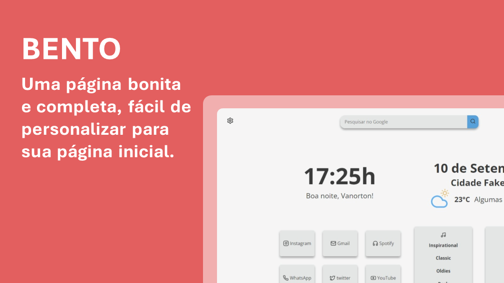
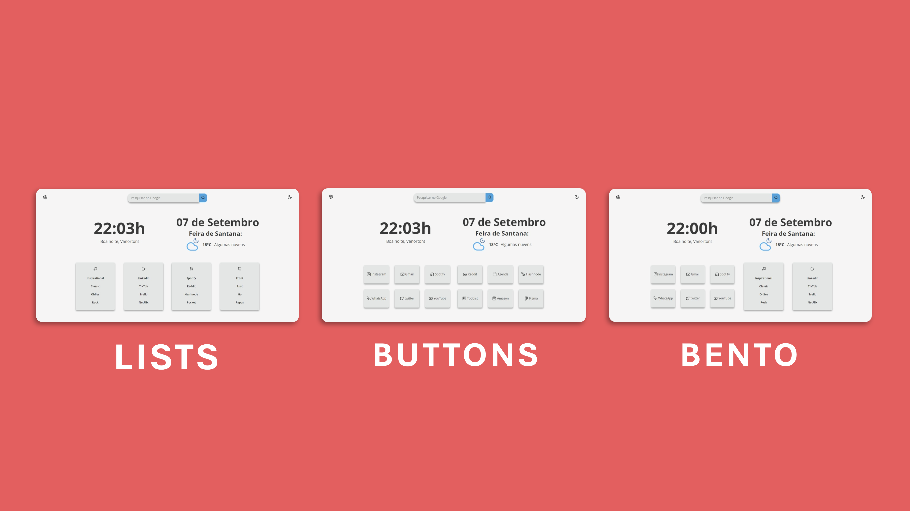

<h1 align="center">Bento</h1>

<a href="https://vanortton.github.io/Bento/" target="_blank">🔗 Visit Bento</a>
 

## 👇 Index
- [👇 Index](#-index)
- [✨ Features](#-features)
- [🚀 Usage](#-usage)
  - [🏡 As Home Page](#-as-home-page)
  - [➕ As New Tab](#-as-new-tab)
- [🎨 Customization](#-customization)
  - [🌄 Background Image](#-background-image)
  - [🌑 Auto change theme](#-auto-change-theme)
  - [👋 General: Name, Weather Icons and Time Format](#-general-name-weather-icons-and-time-format)
  - [📐 Layouts: Bento, Lists and Buttons](#-layouts-bento-lists-and-buttons)

## ✨ Features

- **Easy to configure** on a separate page.
- **Dark/Light** mode, you can toggle it and will be saved in local storage.
- **Layouts!** to customize your experience following your workflow.
- **Clock and Date** format can be set to 24 hour (default) or 12 hour.
- **The current climate** of where you are.

## 🚀 Usage

### 🏡 As Home Page

Set it as Home Page:
   - Click the menu button. and select Options. Preferences.
   - Click the Home panel.
   - Click the menu next to Homepage and new windows and choose to show custom URLs and add the link: https://vanortton.github.io/Bento/

### ➕ As New Tab

You can use different Add-ons/Extensions for it
  - If you use Firefox: [Custom New Tab Page](https://addons.mozilla.org/en-US/firefox/addon/custom-new-tab-page/?src=search) and make sure you enable "Force links to open in the top frame (experimental)" in the extension's preferences page.
  - If you use Chromium (Brave, Vivaldi, Chrome) or Microsoft Edge: [Custom New Tab URL](https://chrome.google.com/webstore/detail/custom-new-tab-url/mmjbdbjnoablegbkcklggeknkfcjkjia)

## 🎨 Customization

### 🌄 Background Image

   - No canto superior esquerdo na página do Bento clique no botão com ícone de engrenagem.
   - Na área das configurações de imagem de fundo clique em Sim e em Carregar Imagem.
   - No final da página clique no botão de salvar.
   - Agora é só voltar para a página inicial e lá vai estar a sua imagem.

### 🌑 Auto change theme

The theme can be set from the following ways:The theme can be set from the following ways:
   - 🌗 By your browser's theme preferences:
      - Change theme by time: No
      - Change theme from system preferences: Yes
      - Change theme automatically: Yes

   - ⌚ From the time:
      - Change theme by time: Yes
      - Change theme from system preferences: No
      - Change theme automatically: Yes

   - 💛 Or you can choose the theme by clicking the button in the upper right corner:
      - Change theme by time: No
      - Change theme from system preferences: No
      - Change theme automatically: No

### 👋 General: Name, Weather Icons and Time Format

  - 👤 User Name:
      - You can change your user name at any time in the first text box at the top of the settings page.
  - ⛅ Weather Icons:
      - Four styles of weather icons are available for you to choose from, just go to the "Weather icons theme" section and select an option.
  - 🕗 Time format:
      - The time format can be either 24-hour or 12-hour, in the "Time in 12-hour format" section and select yes (time in 12-hour format) or no (for time in 24-hour format).

## 📐 Layouts: Bento, Lists and Buttons
  Bento has three different layouts. It allows you to customize your experience by giving you more buttons or more lists, depending on how you feel most comfortable:

  - Bento: A button area and a list area.
  - Buttons: Two button areas and none of lists.
  - Lists: Two list areas and no button areas.
